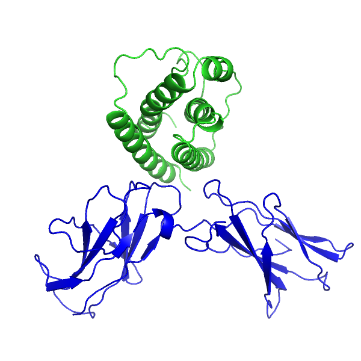

This directory contains the trajectory generated from the simulation of complex of leptin(green)-CRH2 domain (blue, a portion of leptin receptor molecule). The complex is depicted in the figure below

  

