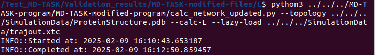

MD-TASK is a software suite for analyzing molecular dynamics trajectories, and the software is implemented in Python. The program is developed by [Brown et al. (2017)](https://pmc.ncbi.nlm.nih.gov/articles/PMC5860072/), and the software is freely accessible and modified [here](https://github.com/RUBi-ZA/MD-TASK). One major feature of the software is performing Residue Interaction Network (RIN) analysis. The analysis is conducted using a branch of Mathematics known as graph theory. In a RIN, each amino acid in protein structure is considered as a node in the network. An edge or a connection between two nodes exists if there is an interaction between the two corresponding amino acids.
	
The software constructs protein graphs and conducts subsequent analyses, such as measuring an amino acid's betweenness centrality or average shortest path, sequentially for each structural frame within a time-series trajectory. This sequential approach can be time-consuming for long simulation trajectories (thousands of nanoseconds) involving large molecules (thousands of atoms). Additionally, the analysis output is saved in .dat files, which may not be optimal for handling large, complex arrays. To address these limitations, the original Python scripts for RIN analysis were modified to enable the use of multiple CPUs for parallel processing of multiple structural frames within the trajectory. The output of each frame analysis is now saved in **.h5** files instead of **.dat** files.

For example, analyzing a 20 ns simulation trajectory of the leptin protein (containing 2279 atoms) sequentially took over 6 minutes to complete. In contrast, parallel processing with 5 CPUs reduced the analysis time to approximately 2 minutes.

<figure>

  
  <figcaption><h2 align="center">Fig.1 - MD-TASK running on sequential</h2></figcaption>
  

</figure>

<figure>

  
  <figcaption><h2 align="center">Fig.2 - MD-TASK running in parallel</h2></figcaption>
  

</figure>

The modified MD-TASK can be found [here](https://github.com/quocbaongo/PythonScripts_MD_Analysis/tree/main/MD-TASK-modification/MD-TASK-program/MD-TASK-modified-program).Users can learn how to execute the modified version of the MD-TASK program by invoking **"python calc_network_updated.py --help"**. The Python script [calc_delta_update.py](https://github.com/quocbaongo/PythonScripts_MD_Analysis/blob/main/MD-TASK-modification/MD-TASK-program/MD-TASK-modified-program/calc_delta_update.py), can be used for further analysis of the raw data output from the [calc_network_updated.py](https://github.com/quocbaongo/PythonScripts_MD_Analysis/blob/main/MD-TASK-modification/MD-TASK-program/MD-TASK-modified-program/calc_network_updated.py) analysis.

The [Simulation_trajectory](https://github.com/quocbaongo/PythonScripts_MD_Analysis/tree/main/MD-TASK-modification/Simulation_trajectory) directory contains the topology and trajectory files resulting from the leptin molecule simulation using the Gromacs simulation package. The "Validation_results" directory contains the RIN analysis outputs from both the original and modified MD-TASK programs, which were compared to ensure compatibility.

This program is modified and distributed based on the original MD-TASK program for Residue Interaction Network analysis, in the hope that it will be useful. However, there is no warranty or fitness for a particular purpose. Users are encouraged to conduct initial test to 100% ensure the compatibility between the output from original and modified programs.
